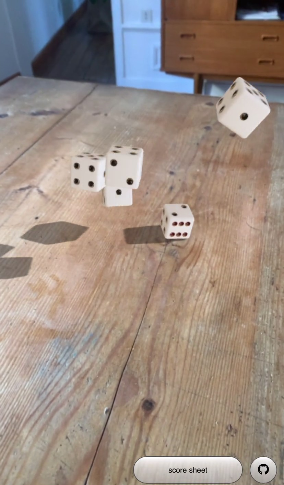
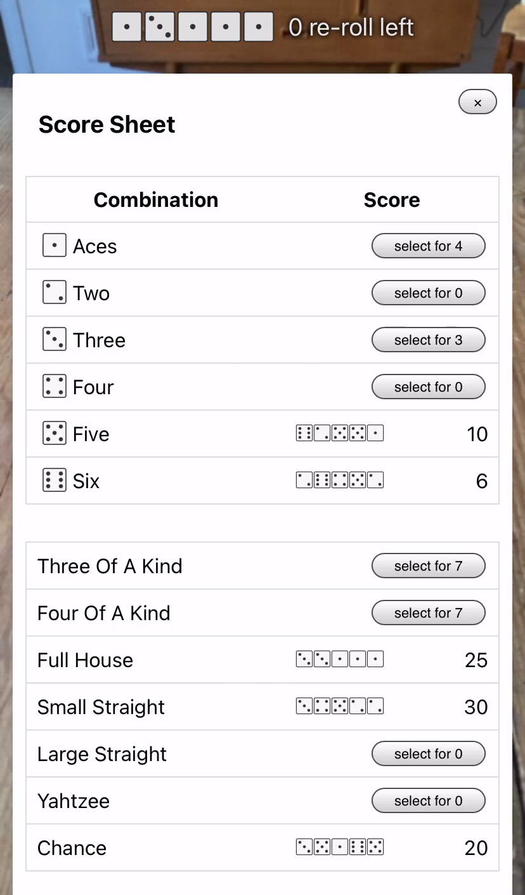
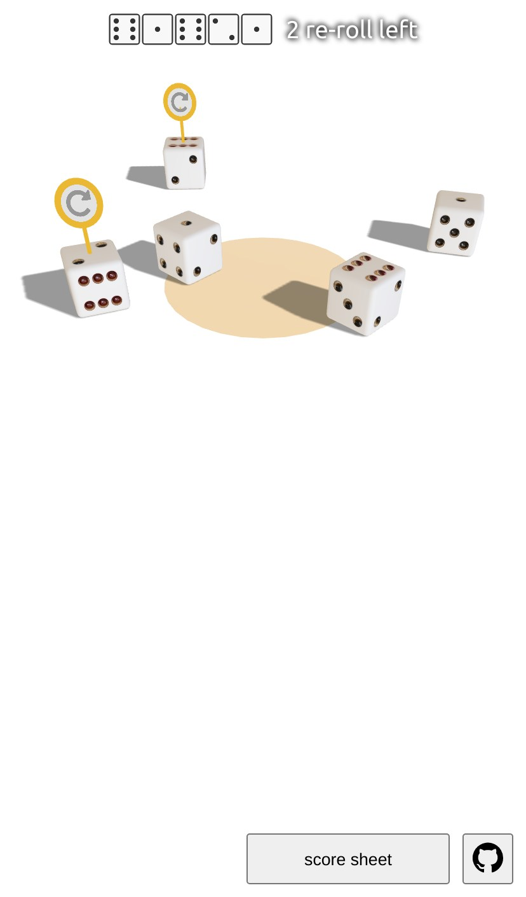

# yAR-htzee


<div>
<a href="https://yar-htzee-platane.surge.sh/game.mp4"></a>



</div>

A pretty cool yahtzee game in augmented reality.

[yAR-htzee](https://yAR-htzee-platane.surge.sh)

> ⚠️ Unfortunately I no longer have a 8thwall plan. The AR features have been disabled.

# Background

This game uses [8thwall](https://www.8thwall.com/products-web#world-tracking) SDK to achieve world tracking.

The dice are renderer with three js using react-three-fiber and the physical world is simulated with cannon.

If the device does not support AR or 8thwall can't be loaded, the game runs without Augmented Reality features.

# Install

```
yarn
```

Be sure to have your 8thwall api key as env `XR8_API_KEY` . Or use a .env file. Or embed the app inside 8thwall sandbox.

# Usage

```
yarn dev
```

# Attribution

- ["Dice"](https://skfb.ly/6RtsC) by tnRaro is licensed under [CC BY 4.0](http://creativecommons.org/licenses/by/4.0/).
- ["Lebombo"](https://hdrihaven.com/hdri/?c=indoor&h=lebombo) by Greg Zaal is licensed under [CC0](https://creativecommons.org/share-your-work/public-domain/cc0/)
